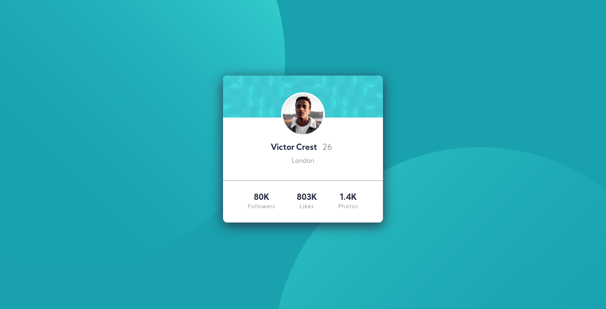
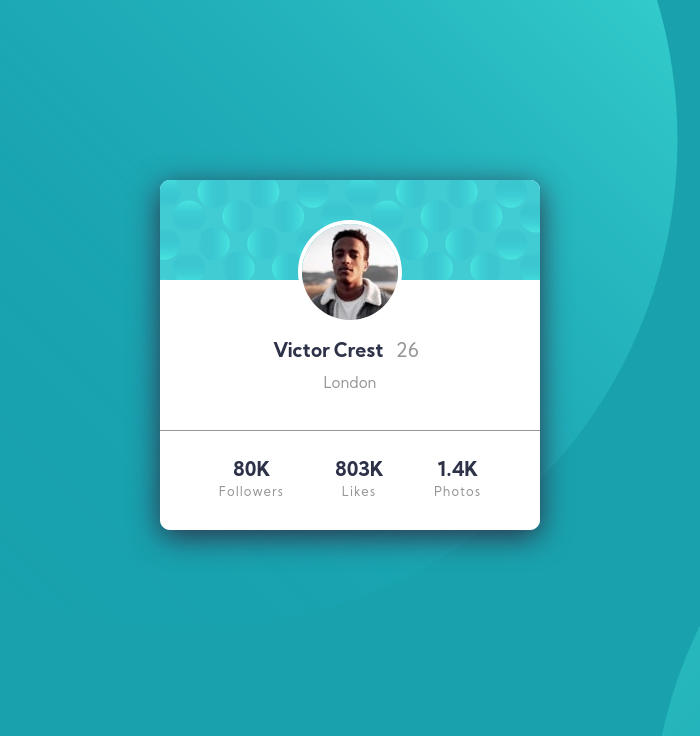

# Frontend Mentor - Profile card component solution Español

Esta es una solución para el [Profile card component challenge on Frontend Mentor](https://www.frontendmentor.io/challenges/profile-card-component-cfArpWshJ). Los retos de Frontend Mentor pueden ayudarte a mejorar tus habilidades por medio de crear proyectos reales.

## Tabla de contenidos
- [Información general](#información-general)
  - [El reto](#el-reto)
  - [Screenshot](#screenshot)
  - [Links](#links)
- [Mi proceso](#mi-proceso)
  - [Herramientas utilizadas](#herramientas-utilizadas)
  - [Recursos](#recursos)
- [Autor](#autor)

## Información general

### El reto

- Hacer el proyecto a partir del diseño dado.

### Screenshot

### Versión de telefono

### Versión escritorio

### Tamaño personalizado

### Links

- URL para la solución: [Solution page](https://www.frontendmentor.io/solutions/html-css-dQQct9uEK)
- URL para probar el sitio: [Github pages](https://caresle.github.io/profile-card-component/)

## Mi proceso

### Herramientas utilizadas

- HTML5
- CSS custom properties
- Flexbox
- CSS Grid
- Mobile-first workflow

### Recursos

- [CSS Basics: Using Multiple Backgrounds](https://css-tricks.com/css-basics-using-multiple-backgrounds/) - Esto me ayudo para saber como usar multiples backgrounds en css.

- [Background position](https://developer.mozilla.org/en-US/docs/Web/CSS/background-position) - Un link a mdn acerca de la propiedad background position y me ayudo para entender mejor como posicionar el fondo.

## Autor

- Frontend Mentor - [@Caresle](https://www.frontendmentor.io/profile/Caresle)
- Instagram - [@caresle1](https://instagram.com/caresle1)