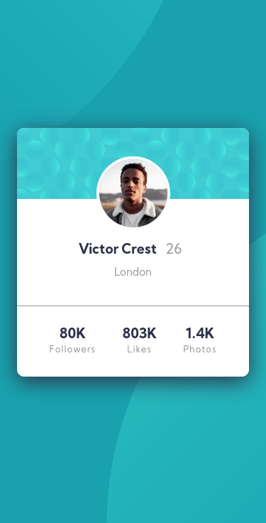
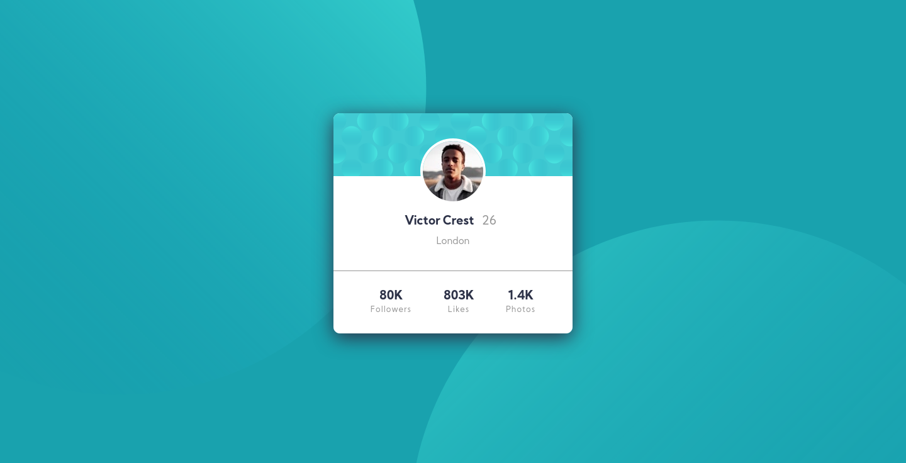
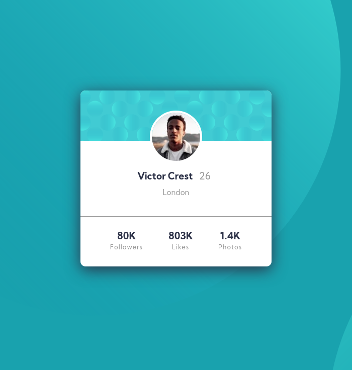

# Frontend Mentor - Profile card component solution

This is a solution to the [Profile card component challenge on Frontend Mentor](https://www.frontendmentor.io/challenges/profile-card-component-cfArpWshJ). Frontend Mentor challenges help you improve your coding skills by building realistic projects. 

## Table of contents

- [Overview](#overview)
  - [The challenge](#the-challenge)
  - [Screenshot](#screenshot)
  - [Links](#links)
- [My process](#my-process)
  - [Built with](#built-with)
  - [Useful resources](#useful-resources)
- [Author](#author)

## Overview

### The challenge

- Build out the project to the designs provided

### Screenshot

### Mobile version

### Desktop version

### Custom size version

### Links

- Solution URL: [Solution page]()
- Live Site URL: [Github pages]()

## My process

### Built with

- HTML5
- CSS custom properties
- Flexbox
- CSS Grid
- Mobile-first workflow

### Useful resources

- [CSS Basics: Using Multiple Backgrounds](https://css-tricks.com/css-basics-using-multiple-backgrounds/) - This helped me for how to use multiple backgrounds on css.

- [Background position](https://developer.mozilla.org/en-US/docs/Web/CSS/background-position) - A link to the mdn about background position property and this helped me for a better understand on how to put the background.

## Author

- Frontend Mentor - [@Caresle](https://www.frontendmentor.io/profile/Caresle)
- Instagram - [@caresle1](https://instagram.com/caresle1)
